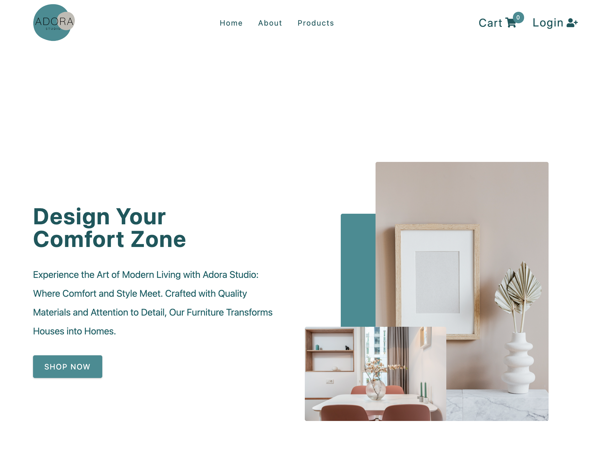
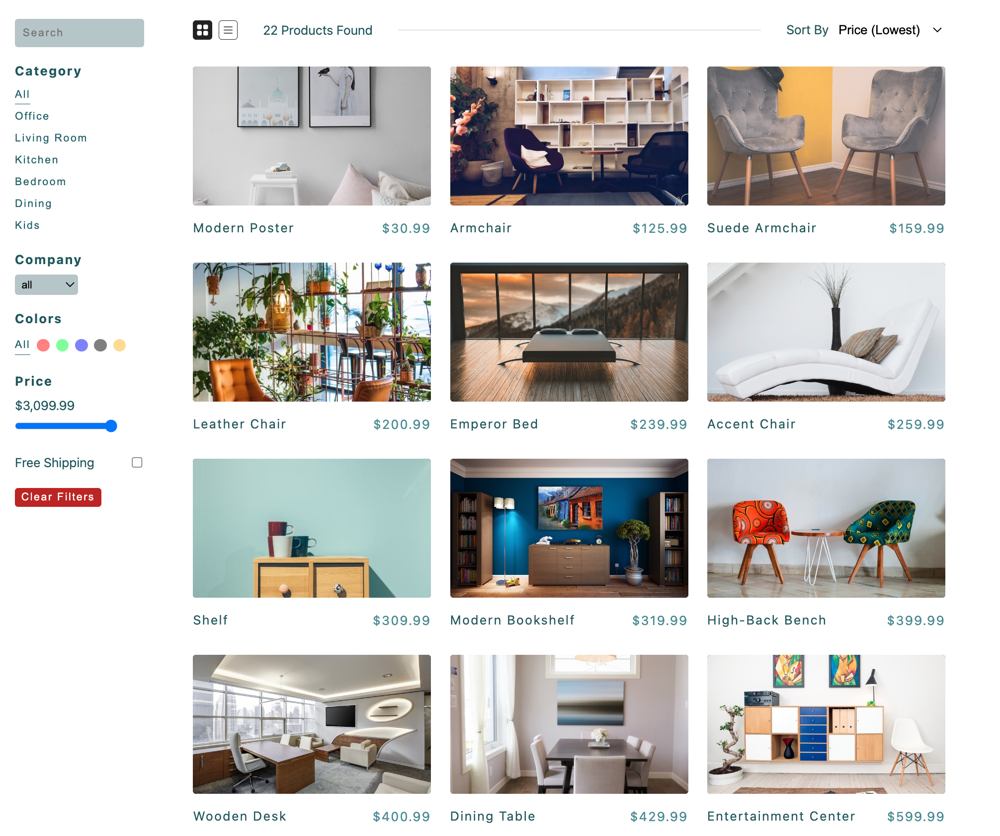
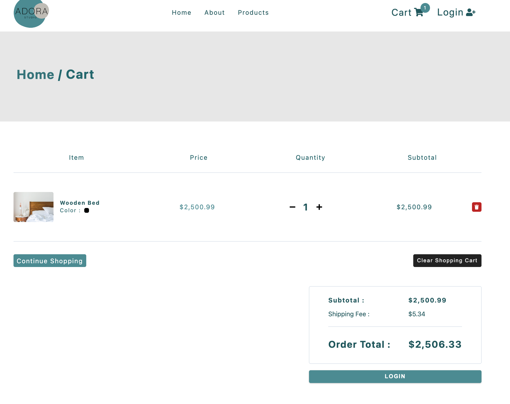

## Link to live demo

To see a live demo of my app, visit https://olenapolko.github.io/adora-studio-ecommerce-project/

## Description

This is a small React-based app that offers a seamless and intuitive e-commerce experience for modern furniture enthusiasts. With easy-to-use filters and search options, users can browse through a wide range of products and add their favorites to their shopping cart. The app uses mock checkout to provide a realistic shopping experience and requires users to authenticate their accounts through Google, Facebook, or Twitter before checking out. Additionally, Formspree is used to collect users' emails from forms, ensuring a secure and reliable shopping experience. The app's sleek and modern design is achieved through the use of Styled Components, making Adora Studio's React App not only functional but visually stunning🙂

## Screenshots

